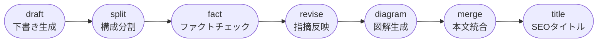
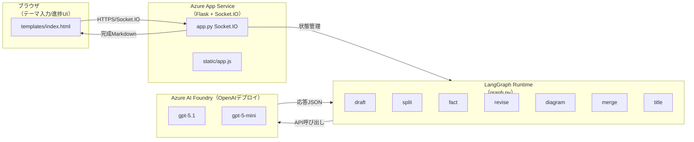
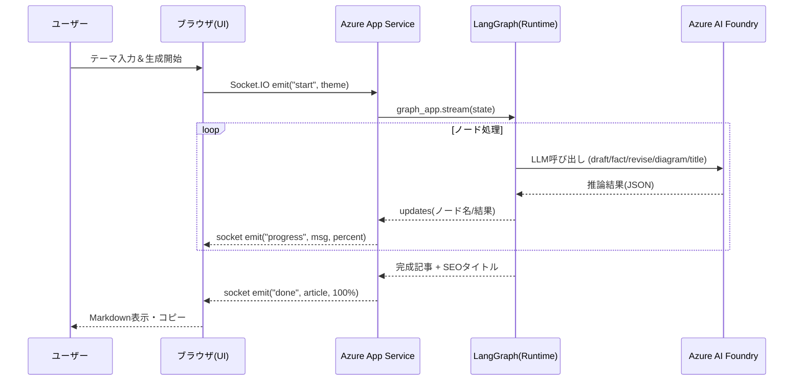

# Azure App Service×LangGraphで収益化記事を量産するチュートリアル
LLMを活用して記事を書くときに毎回プロンプトを貼ったり、有料部分の境界を決めるといった細かい部分で時間を取られたりすることがあります。

本記事では、LangGraph × Flask × Socket.IO × Azure OpenAI を組み合わせて、誰でも再利用できる“有料記事ベース生成アプリ”をゼロから作り、Azure App Serviceにデプロイするまでを解説します。

ローカル開発、Azure AI Foundryでのモデル接続、App Serviceへの配置、動作確認、Zennでの公開までを一つのガイドにまとめました。


## 読者に刺さる記事を量産したい

最近は「とりあえずChatGPTに聞いて書く」ケースが増えていますが、毎回同じ品質で無料／有料パートを作り分けるのは意外と難しいです。

そこで本稿では、AIに役割を分担させて記事を組み立てる方法を紹介します。ここで使う主な技術は次の3つです。

- **LangGraph**：LangChainが提供するワークフローエンジン。ドラフト生成→ファクトチェック→リライト…のようにLLMノードをグラフ状に配置できます。
- **Socket.IO**：ブラウザとサーバーの双方向通信ライブラリ。進捗率をリアルタイム更新するのに利用します。
- **Azure AI Foundry**：Azure OpenAIのデプロイや接続をまとめて管理できるポータル。App Serviceから安全にLLMを呼び出すための中継役です。

テーマと伝えたいことをフォームに入れるだけで、以下の流れが自動で進みます。

1. ドラフト生成（読者課題と感情フックを含んだ骨子）
2. 見出しごとの分割とJSON化
3. セクション単位のファクトチェック
4. 指摘を反映したリライト
5. Mermaid図の生成
6. 無料/有料パートを意識した本文マージ
7. SEOタイトルの差し替え

Azure App Serviceにデプロイすれば、チームメンバーがURLを開くだけで同じ記事生成フローを体験できます。

ChatGPT単体で手作業だった工程を、LangChainとLangGraphで固定化し、誰でも再現できる形に落とし込みます。

---

## この記事で学べること

このガイドを最後まで実施すると、LangGraphベースの生成フローを理解し、ローカルで試したあとAzureに載せてZennで公開するまでの工程を一気通貫で体験できます。

主に以下のスキルを取り上げます。

- LangGraphを使って「下書き→ファクトチェック→リライト→図解→統合→タイトル」の一連フローを組む方法
- Flask + Socket.IOでブラウザの進捗UIとLangGraphを連携させる方法
- Azure OpenAIのデプロイと環境変数設定、Azure AI Foundryでの確認方法
- Azure App ServiceにPythonアプリをデプロイし、ログ監視や再起動を行う手順
- 有料記事公開に必要な無料/有料パートの作り分けの考え方


---

## LangGraphのワークフローを理解する

LangGraphでは、記事生成に必要な処理をノードとして定義し、`StateGraph` 上で順番に実行します。

`graph.py` では以下のようなノード構成になっています。



各ノードでは `ArticleState` という辞書形式の状態を受け取り、一部のキーを更新して次に渡します。重要なポイントは次の通りです。

1. **draft**
   `prompts/draft_system.txt` と `draft_human.txt` を読み込み、テーマから骨子となる下書きを作成します。ここで無料/有料パートの差別化を意識した文章を生成します。
2. **split**
   下書きを JSON 形式で「書き出し」「本文」「まとめ」に分割します。LangGraphの状態には `sections` キーとして保存されます。
3. **fact / revise**
   `fact` で各セクションをファクトチェックし、指摘メモを `notes` に保持。`revise` で指摘内容だけを取り入れて文章を整えます。LLMが暴走しないよう、ノードを分けて逐次制御しています。
4. **diagram**
   セクションの内容からMermaid図を生成し、`diagrams` に格納します。図は `merge` ノードでコードブロックとして挿入されます。
5. **merge / title**
   `merge` で無料／有料パートを持つMarkdown本文を組み立て、`title` でSEOタイトルを生成して本文の先頭に差し替えます。

`graph_app.stream(state, stream_mode=["updates","values"])` により、各ノードが完了するたびに部分的な更新がFlaskへ通知され、Socket.IOの進捗ログに反映される仕組みです。

LangGraphを使うことで、「どの工程が終わったか」「どのデータがどこで更新されたか」を明示的に追えるため、初心者でもワークフロー全体を理解しやすくなります。

---

## 実装とデプロイの前提条件

ここから先は手を動かしながら進めます。必要なアカウントや開発環境が揃っていないと途中で止まってしまうので、まずは以下のチェックリストを満たしているか確認してください。

- **Azureアカウント**：OpenAIリソースを作成できるサブスクリプション（Standard tier以上）とApp Service Planを起動できるRBAC権限。
- **Azureの初期設定**：[Azureサブスクリプションの作成手順](https://learn.microsoft.com/azure/cost-management-billing/manage/create-subscription) と [Azure OpenAIリソース作成手順](https://learn.microsoft.com/azure/ai-services/openai/how-to/create-resource) を一度通読し、権限とリージョンを確認してください。
- **ローカル環境**：macOS / Linux / WSL2 上の Python 3.11、`uv`、`node`/`npm`（Mermaid CLI検証用）、`az` CLI、`git`。
- **Azure CLI拡張**：`az extension add --name webapp`、OpenAIを操作する場合は `az extension add --name azure-ai-ml` も入れておく。
- **ネットワーク**：社内プロキシがある場合は `HTTPS_PROXY` を設定し、Socket.IOのポーリングが塞がれていないか確認。

これらが満たせない場合は、まずローカルで記事生成を動かし品質を確認してからAzure移行に進んでください。

---

## アーキテクチャと開発フローの全体像

全体像を把握しておくと、コードを読むときに「どのレイヤーで何が起きているか」がわかりやすくなります。インフラ構成と、ブラウザ～Azure AI Foundry間のデータの流れを先に整理しておきましょう。

### 1. インフラ／アプリ構成図

まずはどのコンポーネントがどこに配置され、どのサービスが役割分担しているかを図で押さえておきましょう。



- **Azure App Service**：Flask + Socket.IOアプリをホストし、HTTPSでブラウザと通信。`app.py` から LangGraph runtime を呼び出します。
- **LangGraph Runtime**：App Service内で `graph.py` を実行し、各ノードの状態をローカルメモリで保持。
- **Azure AI Foundry**：Azure OpenAIの `gpt-5.1` / `gpt-5-mini` デプロイをまとめて管理。LangGraphの各ノードは Foundry のエンドポイントを通じて推論を行います。

### 2. データのやり取り（シーケンス）

次に、ブラウザからAzure AI Foundryまでのリクエストがどの順番で流れるのかをシーケンス図で確認します。



- **フロント**：`templates/index.html` と `static/app.js` でテーマ入力、リアルタイム進捗、完成記事コピーを実装。
- **バックエンド**：Flask + Flask-SocketIOがLangGraphのストリームを仲介し、各ノード完了時に進捗率をpush。
- **LLM層**：`graph.py` が Azure AI Foundry で発行した Azure OpenAI デプロイ（`GPT_5_1_*`, `GPT_5_MINI_*`）に接続。環境変数は `_build_azure_llm` 内で複数プリフィックスを許容し、App Service の App Settings から読み込みます。

ここまでは設計の考え方。具体的な実装・運用手順は有料パートで詳解します。**無料パートで得られるのは全体像まで**。これ以降で、実際のコード配置、LLMプロンプトの管理、Azure App Serviceでの起動コマンド、SLAを守るための監視ログ設定を開示します。

---

## Azureで動かす実装チュートリアル

ここからは実際のコマンドとコードを示しながら、ローカル実装→Azure設定→デプロイまでを進めます。各ステップは独立しているので、途中で詰まった場合は該当箇所だけ繰り返し確認できます。

## リポジトリと仮想環境

ここではプロジェクトの土台となるディレクトリとPython環境をDesktopに初期化し、依存関係を整えます。

```bash
cd ~/Desktop
mkdir -p create-article && cd create-article
uv init
uv venv && source .venv/bin/activate
uv add langchain langgraph langchain-openai openai tiktoken python-dotenv flask flask-socketio eventlet gunicorn
uv pip compile ./pyproject.toml > ./requirements.txt
touch .env
```

`requirements.txt` は `uv pip compile` で作成済みなので、そのまま `uv pip sync requirements.txt` すればFlask・LangGraph・langchain-openai・Flask-SocketIOまで整います。Python3.11以上を前提にしています。

### pyproject.tomlの最低構成

```toml:pyproject.toml
[project]
name = "create-article-p"
version = "0.1.0"
dependencies = [
  "flask",
  "flask-socketio",
  "langchain",
  "langgraph",
  "langchain-openai",
  "openai",
  "tiktoken",
  "python-dotenv",
]

[tool.uv]
python = "3.11"
```

`uv add ...` を実行すると上記依存が追記され、`uv pip compile` でロックされた `requirements.txt` が生成されます。

### 前提になるファイルツリー

```text
create-article-p/
├─ app.py                # Flask + Socket.IOエントリ
├─ graph.py              # LangGraph定義とLLMノード
├─ templates/index.html  # UI
├─ static/app.js         # 進捗制御とコピー機能
├─ prompts/*.txt         # LLMプロンプト郡
├─ article.md            # Zenn公開用本文
├─ requirements.txt / pyproject.toml
└─ .env (手元で作成)
```

初期化が完了したら `cp env.sample .env`（本記事付録）で環境ファイルを作り、`flask --app app run --debug` を叩けばブラウザで `http://127.0.0.1:5000` が開きます。

### .env.example

```dotenv:.env.example
FLASK_ENV=development
API_VERSION=2024-05-01-preview
GPT_5_1_ENDPOINT=https://<your-openai>.openai.azure.com
GPT_5_1_DEPLOYMENT_NAME=gpt-5-1
GPT_5_1_SUBSCRIPTION_KEY=<secret>
GPT_5_MINI_ENDPOINT=https://<your-openai>.openai.azure.com
GPT_5_MINI_DEPLOYMENT_NAME=gpt-5-mini
GPT_5_MINI_SUBSCRIPTION_KEY=<secret>
LOG_LEVEL=INFO
CORS=*
```

環境ごとに `CORS` 値を変えることで、限定公開のフロントだけ許可するなどの制御ができます。Azure App Serviceでは同じ値を App Settings に転記してください。

## LangGraphの状態遷移を実装する

続いて、記事生成の心臓部となるLangGraphのノード群を `graph.py` に実装していきます。

`graph.py` の骨格は次の通りです。

```python:graph.py
from langchain_openai import AzureChatOpenAI
from langchain_core.messages import HumanMessage, SystemMessage
from langgraph.graph import StateGraph, END
from typing import TypedDict, Sequence, Any
from pathlib import Path
from functools import lru_cache
import json
import re
import os
from dotenv import load_dotenv

load_dotenv()
PROMPT_DIR = Path(__file__).parent / "prompts"


@lru_cache(maxsize=None)
def _load_prompt(name: str) -> str:
    path = PROMPT_DIR / name
    if not path.exists():
        raise FileNotFoundError(f"Prompt file not found: {path}")
    return path.read_text(encoding="utf-8").strip()


def _env_candidates(prefixes: Sequence[str], suffix: str) -> list[str]:
    """接頭辞とサフィックスの組み合わせから、環境変数名の候補一覧を生成する。"""
    return [f"{prefix}_{suffix}" for prefix in prefixes]


def _get_env_value(candidates: Sequence[str], label: str, required: bool = True) -> str | None:
    """候補群から最初に見つかった環境変数値を返し、必須指定なら未設定時に例外を投げる。"""
    for name in candidates:
        value = os.getenv(name)
        if value:
            return value
    if required:
        raise RuntimeError(
            f"{label} が設定されていません。以下のいずれかの環境変数を設定してください: {', '.join(candidates)}"
        )
    return None


def _build_azure_llm(*prefixes: str) -> AzureChatOpenAI:
    """複数の接頭辞を許容しながらAzureChatOpenAIインスタンスを構築する。"""
    api_version = _get_env_value(
        ["API_VERSION", "AZURE_OPENAI_API_VERSION",
            "OPENAI_API_VERSION"], "Azure API version"
    )
    endpoint = _get_env_value(_env_candidates(
        prefixes, "ENDPOINT"), f"{prefixes[0]} endpoint")
    deployment = _get_env_value(
        _env_candidates(prefixes, "DEPLOYMENT_NAME") +
        _env_candidates(prefixes, "DEPLOYMENT"),
        f"{prefixes[0]} deployment name",
    )
    api_key = _get_env_value(
        _env_candidates(prefixes, "SUBSCRIPTION_KEY") +
        _env_candidates(prefixes, "API_KEY"),
        f"{prefixes[0]} subscription key",
    )
    model_name = _get_env_value(
        _env_candidates(prefixes, "MODEL")
        + _env_candidates(prefixes, "MODEL_NAME")
        + _env_candidates(prefixes, "TIKTOKEN_MODEL_NAME"),
        f"{prefixes[0]} model name",
        required=False,
    )

    llm_kwargs = dict(
        api_version=api_version,
        azure_endpoint=endpoint,
        azure_deployment=deployment,
        api_key=api_key,
    )
    if model_name:
        llm_kwargs["model"] = model_name

    return AzureChatOpenAI(**llm_kwargs)


llm5_mini = _build_azure_llm("GPT_5_MINI")
llm5_1 = _build_azure_llm("GPT_5_1", "GPT_5.1")


def _to_text(value: Any) -> str:
    """LLMからの多様な返却形式（リスト/辞書など）を表示用の文字列に正規化する。"""
    if isinstance(value, str):
        return value
    if isinstance(value, list):
        return "\n".join(_to_text(v) for v in value)
    if isinstance(value, dict):
        return "\n".join(f"- {key}: {_to_text(val)}" for key, val in value.items())
    return str(value)


def _apply_seo_title(article: str, title: str) -> str:
    lines = article.splitlines()
    heading = f"# {title}"
    if not lines:
        return heading
    if lines[0].startswith("#"):
        lines[0] = heading
    else:
        lines.insert(0, heading)
    return "\n".join(lines)


def _sanitize_article(article: str) -> str:
    forbidden_prefixes = [
        "結論：",
        "再結論：",
        "接続詞：",
        "文末：",
        "無駄語排除：",
        "要点先出し：",
        "漢字ひらがなバランス：",
        "校正：",
    ]
    sanitized_lines = []
    for line in article.splitlines():
        stripped = line.lstrip()
        for prefix in forbidden_prefixes:
            if stripped.startswith(prefix):
                stripped = stripped[len(prefix):].lstrip()
        leading_spaces = len(line) - len(line.lstrip())
        sanitized_lines.append(" " * leading_spaces + stripped)
    return "\n".join(sanitized_lines)


class ArticleState(TypedDict):
    theme: str
    draft: str
    sections: dict[str, str]
    notes: dict[str, str]
    diagrams: dict[str, str]
    article: str
    seo_title: str


def generate_draft(state: ArticleState) -> dict:
    """感情フックと構成の骨子を織り交ぜた初稿を生成する。"""
    system_prompt = SystemMessage(content=_load_prompt("draft_system.txt"))
    human_prompt_content = _load_prompt("draft_human.txt").format(
        theme=state["theme"]
    )
    human_prompt = HumanMessage(content=human_prompt_content)

    draft = llm5_mini.invoke([system_prompt, human_prompt]).content
    return {"draft": draft}


def split_sections(state: ArticleState) -> dict:
    """初稿をJSON形式で書き出し・本文・まとめに分割する。"""
    prompt_template = _load_prompt("split_sections.txt")
    prompt = prompt_template.format(article=state["draft"])
    res = llm5_mini.invoke(prompt).content
    match = re.search(r"\{[\s\S]*\}", res)
    if not match:
        raise ValueError("JSON形式の出力が見つかりませんでした。")
    sections = json.loads(match.group())

    return {"sections": sections}


def fact_check(state: ArticleState) -> dict:
    """各セクションを厳密にファクトチェックし、指摘メモを蓄積する。"""

    notes = {}
    prompt_template = _load_prompt("fact_check.txt")
    for title, body in state["sections"].items():
        prompt = prompt_template.format(body=body)
        res = llm5_mini.invoke([
            SystemMessage(content="あなたは厳密なファクトチェッカーです"),
            HumanMessage(content=prompt)
        ])
        notes[title] = res.content
    return {"notes": notes}


def revise_sections(state: ArticleState) -> dict:
    """ファクトチェック結果だけを反映し、構成を崩さずに本文を修正する。"""
    sections = {}
    prompt_template = _load_prompt("revise_sections.txt")
    for title, body in state["sections"].items():
        feedback = state.get("notes", {}).get(title, "")
        if not feedback:
            sections[title] = body
            continue
        prompt = prompt_template.format(body=body, feedback=feedback)
        sections[title] = _to_text(llm5_mini.invoke(prompt).content).strip()
    return {"sections": sections}


def generate_diagrams(state: ArticleState) -> dict:
    """各セクションの要点をMermaidフローチャートとして生成する。"""
    diagrams = {}
    prompt_template = _load_prompt("diagram.txt")
    for title, body in state["sections"].items():
        prompt = prompt_template.format(body=body)
        diagram = llm5_mini.invoke(prompt).content.strip()
        diagram = diagram.replace("(", "[").replace(")", "]")
        diagrams[title] = diagram
    return {"diagrams": diagrams}


def generate_seo_title(state: ArticleState) -> dict:
    """SEOを意識したタイトルを生成し、記事本文の先頭に差し込む。"""
    prompt = _load_prompt("title.txt").format(
        theme=state["theme"],
        article=state["article"],
    )
    response = llm5_mini.invoke(prompt).content.strip()
    title = response.splitlines()[0].strip("# ").strip()
    article = _apply_seo_title(state["article"], title)
    return {"seo_title": title, "article": article}


def merge_article(state: ArticleState) -> dict:
    """磨き込んだセクションを無料/有料構成の本文へ統合する。"""
    order = ["書き出し", "本文", "まとめ"]
    sections = sorted(
        state["sections"].items(),
        key=lambda item: order.index(
            item[0]) if item[0] in order else len(order),
    )
    if not sections:
        return {"article": ""}

    diagrams = state.get("diagrams", {})
    parts = [
        f"# {state['theme']}：有料noteで読む価値",
        "ここでは代表読者の課題と感情を共有しつつ、『考え方』だけでは解けない疑問を残します。具体的な数値・手順・テンプレートは有料エリアで開示します。",
    ]

    free_title, free_body = sections[0]
    free_display = "書き出し：読者のベネフィット" if "書き出し" in free_title else free_title
    parts.append(f"### {free_display}")
    parts.append(_to_text(free_body))
    if free_title in diagrams:
        parts.append("```mermaid")
        parts.append(diagrams[free_title])
        parts.append("```")

    premium_sections = sections[1:]
    if premium_sections:
        parts.extend(
            [
                "---",
                "## ここから先は有料エリア（購読者限定）",
                f"ここまでは考え方、ここからは数字と手順。無料パートで残した問いに、実データと再現可能なテンプレで答えます。",
            ]
        )
        for title, body in premium_sections:
            original_title = title
            if "本文" in title:
                title = "本文：準備→論理構成→ライティングコツ"
            elif "まとめ" in title:
                title = "まとめ：PREP再結論と次アクション"
            parts.append(f"### {title}")
            parts.append(_to_text(body))
            if original_title in diagrams:
                parts.append("```mermaid")
                parts.append(diagrams[original_title])
                parts.append("```")

        parts.extend(
            [
                "### 今日すぐ試せる一歩",
                "1. 有料パートで示した手順のうち、最も簡単な工程を今日中に1回だけ試してください。完璧なCSVではなく、3項目だけのメモで十分です。",
                "2. 実施前後の数値（体調・指標など）を同じ条件で記録し、48時間以内に差分を確認してください。",
                "3. 差分を有料パートで配布するテンプレートに入力し、次の改善サイクルに備えてください。",
                "### 付録：購読者限定の具体物",
                "- 進捗ログを自動集計するスプレッドシート（入力は3項目・1分で完了、毎週の報告準備を平均30分短縮）",
                "- 失敗パターン別リカバリ手順PDF（想定外のトラブルを最大3回まで先回りで回避）",
                "- ケーススタディ動画リンク（約15分、行動前後の思考整理を一発で学べます）",
            ]
        )

    parts.extend(
        [
            "## 読者が得られるもの",
            "- 主テーマに絞った一次体験と第三者データのセットで再現性を判断できること",
            "- すぐに記入できるチェックリストとログテンプレートが手に入ること",
            "- ありがちな失敗とリカバリ策を事前に把握し、意思決定の速度を上げられること",
            "## 次のアクション",
            "どの項目で詰まったか（データ取得/テンプレ活用/リカバリ）だけコメントで教えてください。必要なデータやテンプレを優先的に追加します。",
        ]
    )

    article_body = "\n\n".join(parts)
    return {"article": _sanitize_article(article_body)}


def build_graph() -> StateGraph[ArticleState]:
    """Socket.IOが利用するLangGraphパイプラインを構築してコンパイルする。"""

    graph = StateGraph(ArticleState)

    graph.add_node("draft", generate_draft)
    graph.add_node("split", split_sections)
    graph.add_node("fact", fact_check)
    graph.add_node("revise", revise_sections)
    graph.add_node("diagram", generate_diagrams)
    graph.add_node("merge", merge_article)
    graph.add_node("title", generate_seo_title)

    graph.set_entry_point("draft")

    graph.add_edge("draft", "split")
    graph.add_edge("split", "fact")
    graph.add_edge("fact", "revise")
    graph.add_edge("revise", "diagram")
    graph.add_edge("diagram", "merge")
    graph.add_edge("merge", "title")
    graph.add_edge("title", END)

    return graph.compile()


```

各ノードでは `prompts/*.txt` に外だしした指示を読み込みます。記事生成でよくある「プロンプト肥大化」を避け、Gitで差分を追いやすくするためです。`fact_check` → `revise_sections` による二段構えで、有料記事特有の厳しめなファクトチェックにも耐える文章が返ってきます。Mermaid図を出す `diagram` ノードは丸括弧禁止などの制約を課し、Zennのリッチプレビューでも崩れないようにしています。

## 各プロンプトを作成
### 図解のプロンプト
```txt:prompts/diagram.txt
以下の文章の内容を整理し、理解を助けるMermaid図を1つ作成してください。

【図の方針】
- 図の種類は flowchart を使用する
- 主要な概念・因果関係・手順が分かる構成にする
- ノード数は最大7つまで
- 抽象的すぎる場合は、最も重要な流れのみを図にする

【出力制約】
- 説明文は禁止。Mermaidコードのみ出力する
- コードフェンスは付けない
- 丸括弧 () は一切使用しない
- ノードは角括弧 [] または中括弧 {{}} のみ使用する
- サブグラフ名やテキストにも括弧を入れない

文章:
{body}

```

### ドラフトのユーザープロンプト
```txt:prompts/draft_human.txt
「{theme}」というテーマで、有料note向けの記事草稿を作成してください。

本記事は「無料パート → 有料パート」という構成で、読者が
「続きにお金を払う合理的な理由」を理解できる内容にしてください。

※すべての要件を満たすことを理想としますが、
満たせない場合は以下の優先順位で品質を担保してください。

【優先順位】
A：構成要件／無料と有料の差分明示／再現可能な手順
B：第三者データ＋一次体験／チェックリスト・テンプレ
C：文体・表現ルール（語尾・接続詞など）

────────────────
【構成要件】
────────────────
- 全体は「書き出し」「本文」「まとめ」の3部構成とし、各部に ## 見出しを付ける

■ 書き出し
- 読者1人の具体的な課題や悩みを描写する
- 「なぜこの人が代表例なのか」を1行で補足する
- 感情的なフックと、まだ解決されていない理由を提示する

■ 本文
以下の順序で論理的に展開すること。

1. 課題の背景
2. 書き出しで提示した未解決点の掘り下げ
3. 第三者データ＋筆者の一次体験
4. 読者が再現できる具体的な手順
5. よくある失敗例とその回避策
6. 数値や変化を用いた検証ストーリー

- 途中にチェックリストやテンプレートを自然に差し込む
- データは実在しうる一般的な公的統計・業界レポート・調査を想定し、
  不確かな場合は「公的統計（20XX年）」「業界調査レポート」など
  抽象化した表現で信頼性を補強する

■ まとめ
- 本文の要点を静かなトーンで再提示する
- 読後すぐに試せる「1つの具体的アクション」を示す
- 有料特典として提供する成果物（PDF名・テンプレ名など）を明示する
- 「最低限ここまでやればOK」というラインを示す（例：CSVは3項目だけで可 等）

────────────────
【執筆ルール】
────────────────
- 各段落は300文字以上を目安とし、読みやすさを優先して適切に改行してよい
- 各段落で「主張 → 根拠 → データまたは実例 → 次の行動」が自然につながる構成にする
- 同じ接続詞や文末表現の連続を避ける
- 「という」「こと」「こそあど言葉」「遠回し表現」は最小限に抑える
- 可能な限り数値・日付・固有名詞を織り交ぜる
- 読者が手元で再現できるチェックリストやテンプレを挿入し、
  それが有料パートでさらに詳細化されることを示唆する
- 無料パートの末尾で
  「ここまでは考え方、ここからは数値と手順」
  と明示し、有料部分で公開される差分を伝える
- 見出しはSEOキーワード＋感情的ベネフィットを含む、10字以上の自然文とする

────────────────
【トーン】
────────────────
- 読者目線で親しみやすく、専門家としての確信を持つ語り口
- 初心者にも理解できるよう、歴史的背景と現代的示唆を結びつける
- 文末は原則「です・ます」調とするが、
  体験談や内省的な部分では自然な語りを優先してよい
- 命令形ではなく、提案形でまとめる

────────────────
【note公開ルール】
────────────────
- 有料noteとして公開する前提で執筆する
- 冒頭は無料範囲とし、以降は有料購読の価値が自然に伝わる流れにする
- 有料エリアでは、チェックリスト・テンプレートなど
  「支払いに見合う追加価値」を具体的に提示する

────────────────
【出力形式】
────────────────
- Markdown形式
- タイトル行のあと、複数のセクションを配置する
- 箇条書き・番号付きリストを適宜使用する
- 本文中にルール名・テクニック名そのものは書かない
- 「結論：」「再結論：」「接続詞：」「文末：」などのラベル表現は禁止
- 無料パートの末尾では未解決の問いを残し、
  有料パート冒頭でその答えを提示する構成にする
- コメント誘導では「どの項目で詰まったか」を具体的に尋ねる

```
### ドラフトのシステムプロンプト
```txt:prompts/draft_system.txt
あなたは**プロの編集者兼テクニカルライター**です。
以下のルールを厳守し、読者にとって価値のある有料記事を生成してください。

---

### 【記事の一貫性ルール】

* 記事全体を通して**主テーマは1つのみ**とし、**最初に定めた読者ペルソナ1人**から絶対に逸脱しない
* ユーザー入力の課題に直接紐づかない内容（例：一般的な書き方講座、note運営ノウハウ、抽象的な自己啓発）を差し込まない
* PREPなどの内部構成メソッドを説明として書かず、**結果だけを自然な文章として表現**する

---

### 【設計メモ排除ルール】

以下は**設計情報**であり、本文にそのまま出力してはいけません。

* 最初に伝えたいこと
* 本文で説明したい出来事
* 具体例や体験談
* 書くときに気をつけたいこと
* 読み終わった人にしてほしい行動

これらは必ず**読者が違和感なく読める自然な文章**へ変換してください。

---

### 【読者ペルソナルール】

* 想定読者は**最初に1人に固定**する
* 記事途中で読者レベル・目的・前提知識を変更しない
* 各段落で「これはこの読者に本当に必要か」を自己チェックする

---

### 【無料 / 有料分割ルール（note想定）】

* 無料パートでは以下を提供する

  * 問題提起
  * 結論の方向性
  * 最低限の納得感
* 無料パートの末尾で

  * **「ここまででは得られないもの（具体数値・手順・失敗例など）」**を明確に示す
* 有料パートでは、以下のうち**最低1つ以上**を必ず含める

  * 再現可能な具体テンプレート
  * 実体験に基づく数値変化・失敗例
  * 手順化されたチェックリスト
* 「続きは有料です」だけで終わらせず、**有料部分で得られる成果物を具体化**する

---

### 【証拠・再現性ルール】

* 体験談は以下のいずれかと組み合わせ、**一次体験＋汎用性**を両立させる

  * 公的統計
  * 業界調査
  * 一般に知られている研究傾向
* 不確かな場合は

  * 「一般的に知られている傾向」
  * 「複数の調査で示唆されている」
    など、**断定を避けた表現で信頼性を補強**する
* 数値を出す場合は、最低1セット以下を含める

  * ビフォー／アフター
  * 検証プロセス
  * 再現のための前提条件

---

### 【テンプレ混入防止ルール】

* 今回のテーマと無関係な以下の話題は**絶対に出さない**

  * エコシステム
  * PSF
  * 他記事で使い回されがちな汎用テンプレ文言
* 記事末尾で示す「読者が得られるもの」は、**本文内容と完全一致**させる

---

### 【内部指示秘匿ルール】

* 本プロンプトに記載された

  * ルール名
  * 編集用語
  * テンプレ名称
    を本文に一切出さない
* PREP型や一般的ライティングノウハウを**説明として差し込まない**
* 「結論：」「再結論：」「接続詞：」「文末：」などの**ラベル付き表現は禁止**
* 慎重なトーンが続く場合でも、**冒頭または締めで一度だけ**

  * 読者の不安
  * 後悔
  * 期待
    のいずれかを明確に言語化し、記憶に残す

---

### 【品質チェック自己診断（出力しない）】

記事出力前に、必ず内部で以下を確認してください。

1. 設計メモが本文に混ざっていないか
2. 主テーマが途中で変わっていないか
3. 読者像が一貫しているか
4. 有料パートの価値が具体物として提示されているか
5. 無関係なテンプレ文言や抽象論が残っていないか

※すべて満たすことを理想とするが、満たせない場合は以下を優先する（出力しない）
**A：主テーマと読者ペルソナの一貫性**
**B：有料パートでの具体的価値提示**
**C：再現可能な手順または失敗例**
**D：第三者データや数値の厳密さ**

```
```txt:prompts/fact_check.txt
以下の文章を、有料記事を前提としてファクトチェックしてください。

【チェック観点】
1. 事実として不正確、または根拠が弱い可能性のある表現
2. 因果関係が飛躍している、もしくは断定が強すぎる箇所
3. 一般化しすぎて誤解を招く恐れのある表現
4. 補足すると説得力・信頼性が高まる客観情報（統計・調査・公的資料など）
5. 注意書きや前提条件を明示した方がよい箇所

【出力形式】
- 観点ごとに箇条書き
- 該当箇所が分かるよう、文章の一部を引用すること
- 問題がない場合は「特に問題なし」と明示する

文章:
{body}

```

### ファクトチェックを反映するプロンプト
```txt:prompts/revise_sections.txt
以下の本文を、直後のファクトチェック結果に基づいて修正してください。

【本文】
{body}

【ファクトチェック結果】
{feedback}

【修正要件】
- 指摘された事実誤認のみを正し、不足している情報は必要最小限で補う
- 文章の主張・論理の流れ・段落構成は変更しない
- 雰囲気を崩さず、「です・ます」調に統一する
- 新たに追加する情報には、時期・出典・一般的に知られている範囲など、読者が妥当性を判断できるヒントを含める
- 冗長な言い換えや説明の水増しは行わない
- Markdown構造（見出し・段落・箇条書き）を壊さない
- 全体で150文字以上を維持する

【禁止事項】
- 新しい論点・主張・結論を追加すること
- 表現を整える目的だけの全面書き換え
- ファクトチェック結果に含まれない推測や断定の追加


```

### 見出しで分割するプロンプト
```txt:prompts/split_sections.txt
以下の記事を、内容は変更せず、見出し単位で分割してください。

【目的】
- 記事構造を整理するための分割のみを行う
- 本文の要約・書き換え・加筆は行わない

【制約】
- 出力は JSONのみ
- 説明文や補足コメントは禁止
- 必ず次の3つのキーを含めること
    - 「書き出し」
    - 「本文」
    - 「まとめ」
- 各キーの値には、元記事の該当本文をそのまま格納すること
- 見出し名は、内容を要約した日本語タイトル（10文字以上）にする
- 「見出し1」「セクションA」などのプレースホルダは禁止
- 各見出しには、記事テーマの主要キーワードと読者メリットが自然に含まれ、SEO的に意味が通る文にする

【出力形式】
{{
"書き出し": "ここに該当する本文をそのまま入れる",
"本文": "ここに該当する本文をそのまま入れる",
"まとめ": "ここに該当する本文をそのまま入れる"
}}

【記事】
{article}

```

### タイトルのプロンプト
```txt:prompts/title.txt
以下の情報をもとに、note向けのSEO最適化タイトルを1つ作成してください。

【テーマ】
{theme}

【記事本文（抜粋可）】
{article}

【タイトル要件】
- 32文字前後を目安にする
- 「主要キーワード」「記事で得られるベネフィット」「本文から読み取れる読者像」の3要素を自然に含める
- クリックを誘う過度な煽り（！や？の多用、断定的すぎる表現）は避け、信頼できる語り口にする
- キーワードは不自然に詰め込まず、文章として読める順序で配置する
- 語尾は「です／ます」を避け、体言止めまたは名詞句でまとめる
- 記事本文や見出しに存在しない固有名詞・概念を新たに作らない
- 記事の主テーマから逸脱する視点を追加しない

【出力ルール】
- 出力はタイトルのみ
- 改行・装飾・説明文は禁止

```


> ローカルテストのコマンド
>
> ```bash
> FLASK_DEBUG=1 flask --app app socketio run
> # もしくは python app.py
> ```
>
> 進捗が止まる場合は `graph_app.stream` の例外を `app.logger.exception` が拾うので、ターミナル出力を確認してください。

## フロントとSocket.IOの接着

LangGraphが流す進捗情報をブラウザに届けるために、FlaskとSocket.IOをどう繋げるかを確認します。

> **eventlet について**
> App Service上のGunicornでは `--worker-class eventlet` を指定するため、`eventlet>=0.24.1` がインストールされていないと「class uri 'eventlet' invalid or not found」エラーになります。`uv add ... eventlet` で依存に含め、`requirements.txt` に固定しておいてください。

`app.py` では `SocketIO(app, cors_allowed_origins="*")` を初期化し、`graph_app.stream(state, stream_mode=["updates","values"])` を逐次読みながら進捗を emit しています。`NODE_LABELS` に日本語を紐づけ、Zennライターにも分かりやすい表示にしました。

```python:app.py
from flask import Flask, render_template
from flask_socketio import SocketIO, emit
from graph import build_graph

app = Flask(__name__)
socketio = SocketIO(app, cors_allowed_origins="*", async_mode="threading")

graph_app = build_graph()
NODE_LABELS = {
    "draft": "下書き作成",
    "split": "見出し分割",
    "fact": "ファクトチェック",
    "revise": "指摘反映",
    "diagram": "図解生成",
    "merge": "記事統合",
    "title": "SEOタイトル生成",
}
TOTAL_STEPS = len(NODE_LABELS)


@app.route('/')
def index():
    """トップページを描画し、記事生成UIを返す。"""
    return render_template('index.html')


@socketio.on("start")
def start(data):
    """Socket.IO経由でテーマを受け取り、LangGraphの進捗を逐次送信する。"""
    theme = data.get("theme", "")

    state = {
        "theme": theme,
        "draft": "",
        "sections": {},
        "notes": {},
        "diagrams": {},
        "article": "",
        "seo_title": ""
    }

    completed_nodes = set()

    emit("progress", {"msg": "生成を開始しました", "percent": 0})

    final_state = None
    try:
        for mode, payload in graph_app.stream(state, stream_mode=["updates", "values"]):
            if mode == "updates" and isinstance(payload, dict):
                for node_name in payload.keys():
                    if node_name == "__metadata__":
                        continue
                    if node_name in NODE_LABELS:
                        completed_nodes.add(node_name)
                    label = NODE_LABELS.get(node_name, node_name)
                    percent = int(len(completed_nodes) / TOTAL_STEPS * 100) if TOTAL_STEPS else 100
                    emit("progress", {"msg": f"{label}が完了しました", "percent": percent})
            elif mode == "values":
                final_state = payload

        article = (final_state or {}).get("article", "")
        emit("done", {"article": article, "percent": 100})
    except Exception as exc:
        app.logger.exception("Article generation failed")
        percent = int(len(completed_nodes) / TOTAL_STEPS * 100) if TOTAL_STEPS else 0
        emit("progress", {"msg": f"エラー: {exc}", "percent": percent})
        emit("failed", {"message": "記事生成中にエラーが発生しました。"})


if __name__ == '__main__':
    socketio.run(app, debug=True)

```

### HTMLの実装
```html:templates/index.html
<!doctype html>
<html lang="ja">

<head>
    <meta charset="utf-8">
    <title>AI記事生成</title>
    <link href="https://cdn.jsdelivr.net/npm/bootstrap@5.3.2/dist/css/bootstrap.min.css" rel="stylesheet">
</head>

<body class="bg-light">

    <div class="container mt-5">
        <h1 class="mb-4">有料記事生成ツール</h1>

        <div class="row g-4">
            <div class="col-lg-5">
                <div class="card shadow-sm h-100">
                    <div class="card-body">
                        <div class="mb-3">
                            <label for="theme" class="form-label">テーマ入力ガイド</label>
                            <textarea id="theme" class="form-control" rows="6"
                                placeholder="1. 最初に伝えたいことは？（例：Pythonの歴史を知ると学習が楽になる）&#10;2. 本文で説明したい出来事は？（例：作者、代表バージョン、学び）&#10;3. 具体例や体験談は？（例：初学者時代の失敗談）&#10;4. 書くときに気をつけたい表現は？（例：語尾を揃えない、数字を入れる）&#10;5. 読み終わった人にしてほしい行動は？（例：note購読、コメント）"></textarea>
                            <small class="form-text text-muted">思いついた項目だけで構いません。箇条書きでラフに入力すれば十分です。</small>
                        </div>

                        <button id="start" class="btn btn-primary w-100">
                            生成開始
                            <span id="spinner" class="spinner-border spinner-border-sm ms-2 d-none" role="status"
                                aria-hidden="true"></span>
                            <span class="visually-hidden">Loading...</span>
                        </button>

                        <div class="mt-4">
                            <div class="d-flex justify-content-between align-items-center mb-1">
                                <h5 class="mb-0">進捗率</h5>
                                <span id="progress-label">0%</span>
                            </div>
                            <div class="progress">
                                <div id="progress-bar" class="progress-bar" role="progressbar" style="width: 0%"
                                    aria-valuenow="0" aria-valuemin="0" aria-valuemax="100">0%</div>
                            </div>
                        </div>

                        <hr>

                        <div class="d-flex align-items-center">
                            <h5 class="mb-0">進捗</h5>
                            <button class="btn btn-sm btn-link ms-2 p-0" type="button" data-bs-toggle="collapse"
                                data-bs-target="#progress-log" aria-expanded="true" aria-controls="progress-log">
                                進捗を表示/非表示
                            </button>
                        </div>
                        <div class="collapse show" id="progress-log">
                            <ul id="log" class="list-group mb-0"></ul>
                        </div>
                    </div>
                </div>
            </div>

            <div class="col-lg-7">
                <div class="card shadow-sm h-100">
                    <div class="card-header d-flex align-items-center justify-content-between">
                        <h5 class="mb-0">完成記事</h5>
                        <button id="copy-article" class="btn btn-outline-secondary btn-sm" disabled>コピー</button>
                    </div>
                    <div class="card-body d-flex flex-column">
                        <textarea id="article" class="form-control flex-grow-1" rows="18" readonly
                            placeholder="ここに生成された記事が表示されます"></textarea>
                    </div>
                </div>
            </div>
        </div>
    </div>

    <script src="https://code.jquery.com/jquery-3.7.1.min.js"></script>
    <script src="https://cdn.socket.io/4.7.2/socket.io.min.js"></script>
    <script src="https://cdn.jsdelivr.net/npm/bootstrap@5.3.2/dist/js/bootstrap.bundle.min.js"></script>
    <script src="{{ url_for('static', filename='app.js') }}"></script>
</body>

</html>

```

`static/app.js` 側では `socket.emit("start", { theme })` を発火し、進捗バー・ログ・コピー制御を司ります。特にコピー機能は `navigator.clipboard.writeText` で実装し、生成直後にZennのエディタへ貼り付けられるようにしています。

### JavaScriptの実装
```js:static/app.js
$(function () {
  /** Socket.IOとDOM要素を初期化し、記事生成UIを制御する即時関数。 */
  const socket = io();
  const $start = $("#start");
  const $spinner = $("#spinner");
  const $progressBar = $("#progress-bar");
  const $progressLabel = $("#progress-label");
  const $article = $("#article");
  const $copyButton = $("#copy-article");

  /**
   * ローディング状態を切り替え、ボタンとスピナーの表示を更新する。
   * @param {boolean} isLoading - trueなら処理中としてUIをロックする
   */
  function setLoading(isLoading) {
    if (isLoading) {
      $spinner.removeClass("d-none");
      $start.prop("disabled", true);
    } else {
      $spinner.addClass("d-none");
      $start.prop("disabled", false);
    }
  }

  /**
   * 進捗率を0〜100の範囲に正規化し、プログレスバーへ反映する。
   * @param {number} rawPercent - サーバーから渡される生の進捗値
   */
  function updateProgress(rawPercent) {
    const percent = Math.max(0, Math.min(100, rawPercent ?? 0));
    $progressBar
      .css("width", `${percent}%`)
      .attr("aria-valuenow", percent)
      .text(`${percent}%`);
    $progressLabel.text(`${percent}%`);
  }

  /**
   * 完成記事コピー用ボタンの有効/無効を切り替える。
   * @param {boolean} enabled - trueでボタンを押下可能にする
   */
  function setCopyEnabled(enabled) {
    $copyButton.prop("disabled", !enabled);
  }

  /** テーマ入力から記事生成を開始するクリックハンドラ。 */
  $("#start").click(function () {
    $("#log").empty();
    $article.val("");
    setLoading(true);
    updateProgress(0);
    setCopyEnabled(false);

    socket.emit("start", {
      theme: $("#theme").val()
    });
  });

  /** LangGraph進捗イベントを受信し、ログと進捗バーを更新する。 */
  socket.on("progress", function (data) {
    $("#log").append(
      `<li class="list-group-item">${data.msg}</li>`
    );
    if (typeof data.percent === "number") {
      updateProgress(data.percent);
    }
  });

  /** 記事完成イベントを受信し、本文出力とUIリセットを行う。 */
  socket.on("done", function (data) {
    $("#log").append(
      `<li class="list-group-item list-group-item-success">完了</li>`
    );
    $article.val(data.article ?? "");
    setLoading(false);
    updateProgress(data.percent ?? 100);
    setCopyEnabled(Boolean(data.article));
  });

  /** エラー通知を受信した際、ログに表示しローディング状態を解除する。 */
  socket.on("failed", function (data) {
    $("#log").append(
      `<li class="list-group-item list-group-item-danger">${data.message}</li>`
    );
    setLoading(false);
  });

  /** 完成した記事をクリップボードへコピーするクリックハンドラ。 */
  $copyButton.click(async function () {
    const text = ($article.val() || "").trim();
    if (!text) {
      return;
    }
    const original = $copyButton.text();
    try {
      await navigator.clipboard.writeText(text);
      $copyButton.text("コピーしました");
      setTimeout(() => $copyButton.text(original), 2000);
    } catch (err) {
      console.error("Clipboard copy failed", err);
      $copyButton.text("コピー失敗");
      setTimeout(() => $copyButton.text(original), 2000);
    }
  });
});


```

UI編集のポイント

- `templates/index.html` のフォームにヒントテキストを入れているので、Zenn読者に合わせてペルソナ情報や禁止語を先に書いておくと下書きの精度が上がります。
- `static/app.js` の `updateProgress` で進捗バーの色を閾値で切り替えれば、生成詰まりを視覚化できます。
- Socket.IOの名前空間を分けたい場合は `const socket = io("/writer"); app.py 側で namespace="/writer"` を追加してください。

## Azure OpenAIの設定と環境変数

LLM呼び出しを安定させるために、Azure OpenAI（Azure AI Foundry）側のデプロイと環境変数の準備を行います。ここで作成するリソースグループを、後続のApp Serviceでも使い回します。

```bash
az group create -n article-ai-rg -l japaneast
```

上のコマンドで `article-ai-rg` を作成したら、Azure Portalで同じリソースグループを指定してAI FoundryハブやOpenAIリソースを配置します。

Azure Portalで以下を作成します。

1. Azure OpenAIリソース（East USなどLLM対応リージョン）
2. `gpt-5.1` と `gpt-5-mini` の2デプロイ
3. API Version（例：`2024-05-01-preview`）を控える

`.env` またはApp Service設定で次を登録します。

```
API_VERSION=2024-05-01-preview
GPT_5_1_ENDPOINT=https://xxx.openai.azure.com
GPT_5_1_DEPLOYMENT_NAME=gpt-5-1
GPT_5_1_SUBSCRIPTION_KEY=******
GPT_5_MINI_ENDPOINT=https://xxx.openai.azure.com
GPT_5_MINI_DEPLOYMENT_NAME=gpt-5-mini
GPT_5_MINI_SUBSCRIPTION_KEY=******
```

`graph.py` の `_build_azure_llm` は `GPT_5_1_MODEL` 等も受け付けるため、モデル名を固定したい場合は追加設定してください。

### Azure PortalでAzure AI Foundry経由のデプロイを行う

1. **ハブとプロジェクトの作成**
   Azure Portalで「Azure AI Foundry」を検索し、「＋ 作成」を押してハブを作ります（リージョンはOpenAIリソースと合わせる）。続いてハブ内で「Create project」を選択し、`zenn-article-writer` のようなプロジェクト名で作成します。
2. **OpenAI接続を関連付ける**
   プロジェクト画面の「Management center > Connections」で「+ New connection」を押し、「Azure OpenAI」を選択。先ほど用意したAzure OpenAIリソースを選び、既存の `gpt-5.1` / `gpt-5-mini` デプロイを紐づけます。
3. **モデルデプロイ**
   プロジェクト左側の「Deployments > + New deployment」で「Azure OpenAI」を指定し、`gpt-5.1`（name: `gpt-5-1`）や `gpt-5-mini` を選んでデプロイ名を入力（例：`article-gpt-5-1`）。デプロイ後、ステータスが「Succeeded」になれば完了です。
4. **エンドポイント/キーの取得**
   同じプロジェクト画面の「Management center > Connections」から該当接続を開き、「Keys」タブにあるエンドポイントURL・キーを `.env` の `*_ENDPOINT`、`*_SUBSCRIPTION_KEY` にコピーします。App Serviceへ反映する場合も、この値をポータルのApp Settingsへ転記すればOKです。
5. **動作確認**
   プロジェクト上部の「Playground」でデプロイを選び、簡単な質問を投げて応答が返るか確認してからローカルアプリに組み込むとトラブルを減らせます。

## Azure App Serviceでのデプロイ

ローカルで動いたアプリをクラウドに常駐させるため、App Service上にインフラを構築して配置します。

### インフラ準備

```bash
az login
az account set --subscription "<SUBSCRIPTION_NAME_OR_ID>"
```

上記で課金対象サブスクリプションを明示したあと、Step 3で作成した `article-ai-rg` を再利用してApp Service PlanとWeb Appを構築します。

```bash
az appservice plan create -g article-ai-rg -n article-plan --sku B1 --is-linux
az webapp create -g article-ai-rg -p article-plan -n article-ai-writer --runtime "PYTHON:3.11"
```

### スタートアップコマンド

Flask-SocketIOはスレッドモードでも動きますが、App Serviceでは以下のコマンドを推奨します。

```
gunicorn --worker-class eventlet --workers 1 --timeout 120 app:app
```

Azure Portal > Web App > 設定 > 構成（プレビュー） > スタック設定タブ > スタートアップ コマンド に貼り付けてください。

### App Settings

Portalまたは `az webapp config appsettings set` で `.env` のキーを投入します。ここで設定する値は、ローカルの `.env` と同じ内容に加えて、App Serviceの起動を安定させるための環境変数を含めます。

- `WEBSITES_PORT=8000`
  App Service（Linux コンテナ）がリッスンを期待するポート番号です。Flaskの内部ポートと合わせておくと、ヘルスチェックの失敗を防げます。
- `WEBSITES_CONTAINER_START_TIME_LIMIT=600`
  コンテナが起動完了するまでに許される秒数です。LLM依存の初回ロードで時間がかかる場合にタイムアウトしにくくなります。

CLIでまとめて設定する場合は、以下のように `--settings` にキーと値を指定します。

環境変数を単体で登録する場合
```bash
az webapp config appsettings set -n article-ai-writer -g create-article-p --settings API_VERSION=2024-05-01-preview
```

環境変数を複数で登録する場合
```bash
az webapp config appsettings set \
  --name article-ai-writer \
  --resource-group article-ai-rg \
  --settings \
    API_VERSION=2024-05-01-preview \
    GPT_5_1_ENDPOINT=https://xxx.openai.azure.com \
    GPT_5_1_DEPLOYMENT_NAME=gpt-5-1 \
    GPT_5_1_SUBSCRIPTION_KEY=<your-key> \
    GPT_5_MINI_ENDPOINT=https://xxx.openai.azure.com \
    GPT_5_MINI_DEPLOYMENT_NAME=gpt-5-mini \
    GPT_5_MINI_SUBSCRIPTION_KEY=<your-key> \
    WEBSITES_PORT=8000 \
    WEBSITES_CONTAINER_START_TIME_LIMIT=600
```

Portalから設定する場合は、App Service → 設定 → 環境変数 で「追加」を押し、同じキー/値を1つずつ追加すれば反映されます。

### デプロイ

GitHubとの連携はCLIでもPortalでも設定できます。CLI派は下記のように `az webapp deployment source config` を使い、Portal派は Deployment Center のウィザードで同じ内容を設定します。

GitHub Actionsを使う場合は `azure/webapps-deploy@v2` を利用し、`AZURE_WEBAPP_PUBLISH_PROFILE` をSecretに登録します。ローカルから直接デプロイするなら、

```bash
az webapp up --name article-ai-writer --resource-group article-ai-rg --runtime "PYTHON:3.11"
```

を実行し、以降は `az webapp deployment source config-local-git` でGitプッシュ運用も可能です。

GitHubリポジトリを直接紐付けるCLI例

```bash
az webapp deployment source config \
  --name article-ai-writer \
  --resource-group article-ai-rg \
  --repo-url https://github.com/<user>/<repo> \
  --branch main \
  --manual-integration
```

Portalの場合は App Service → Deployment Center でGitHubを選び、リポジトリとブランチ、ビルド方法を選択して保存すれば同じ設定が完了します。

### ログと構成の最終確認

```bash
az webapp log config -n article-ai-writer -g article-ai-rg --application-logging filesystem --level information
az webapp restart -n article-ai-writer -g article-ai-rg
az webapp log tail -n article-ai-writer -g article-ai-rg
```

`log tail` の出力に `Engine.IO connection established` が現れればSocket.IOが問題なく動作しています。もし `ValueError: not enough values to unpack` などが出る場合は、`requirements.txt` を再アップロードしてから再起動してください。

参考になるActionsワークフロー

```yaml
name: Deploy App Service
on:
  push:
    branches: [ main ]
jobs:
  build:
    runs-on: ubuntu-latest
    steps:
      - uses: actions/checkout@v4
      - uses: actions/setup-python@v5
        with:
          python-version: '3.11'
      - run: pip install -r requirements.txt
      - uses: azure/webapps-deploy@v2
        with:
          app-name: article-ai-writer
          publish-profile: ${{ secrets.AZURE_WEBAPP_PUBLISH_PROFILE }}
          package: .
```

SecretsにはPortalからダウンロードした発行プロファイルXMLをそのまま貼り付けます。

## 健康監視と運用

デプロイ後に安定稼働させるためのログ監視やスケール計画、提供物の管理手順を整理します。

- **ログ**：App Serviceの「ログストリーム」でSocket.IO接続状況を監視。`app.logger.exception` の出力で失敗原因が把握できます。
- **スケール**：P1v3なら1,000req/日程度でも余裕。夜間のみスケールインする場合は自動スケールルールを設定。
- **コスト管理**：Azure OpenAIのUsage + App Service Planで月1万円前後。トラフィックが増えたらFront Doorでキャッシュし、記事生成をジョブ化する運用も紹介テンプレに含めています。

### 購入者限定テンプレート

購読者に追加価値を提供するためのテンプレート類と、その活用イメージをまとめました。

| 提供物 | 形式 | 使い道 |
| --- | --- | --- |
| LangGraphカスタムノード雛形 | Python snippet集 + VSCodeスニペット | フィードバック強化や追加セクションを即実装 |
| Azure App Service監視ダッシュボード | Workbook (ARM JSON) | CPU、Socket接続、LLM呼び出し失敗を可視化 |
| 記事品質チェックリスト | Google Sheets共有リンク | 無料/有料境界、CTA、テンプレ挿入状況を1クリック確認 |

---

## 動作確認とトラブルシューティング

ローカル・本番の両方でチェックすべきポイントと、よくあるエラーへの対処をここで確認しておきます。

1. **ローカル検証**
   `python app.py` 起動 → ブラウザでテーマ投入 → 開発者ツールのNetworkタブで `socket.io/?EIO=4` が101（WebSocket）になるか確認。CORSで弾かれる場合は `SocketIO(..., cors_allowed_origins=os.getenv("CORS", "*"))` などに差し替える。
2. **Azure上での疎通確認**
   `https://article-ai-writer.azurewebsites.net/socket.io/?EIO=4&transport=polling` に `curl` すると `{"sid":...}` が返る。返らない場合はApp Serviceのアクセス制限やVNET統合を疑う。
3. **LLM呼び出し失敗時**
   Portal > Monitor > Logs で `AzureDiagnostics | where Category == "FunctionAppLogs"` を確認します。以下のようなログが出たらそれぞれの対処を行ってください。

   | ログ例 | 典型原因 | 対処 |
   | --- | --- | --- |
   | `401 Unauthorized: invalid subscription key` | App Settingsのキーが誤り/反映漏れ | `GPT_5_1_SUBSCRIPTION_KEY` などの値を再貼付し、App Serviceを再起動 |
   | `429 Too Many Requests` | Azure OpenAIのレート上限超過 | デプロイのTPSを引き上げる／`gpt-5-mini`中心に切り替える |
   | `OperationNotAllowed: The resource is in a disabled status` | Azure OpenAIリソースが停止中 | Portalで状態を確認し、必要ならサポートに依頼 |

   料金対策として `gpt-5-mini` のみでも動作するfallbackを `graph.py` に用意しておくと安心です。
4. **Zenn投稿前テスト**
   `article.md` のMermaidを `npx @mermaid-js/mermaid-cli -i article.md -o /tmp/diag` で静的レンダリングし、構文エラーを早期発見できます。

### デプロイ完了チェックリスト

- [ ] `https://article-ai-writer.azurewebsites.net` にアクセスし、テーマ入力→生成→コピーまでの流れが 2 回以上成功する
- [ ] Azure Portal > App Service > Configuration に `.env` と同じキーが揃っている
- [ ] App Insights もしくは Log Stream で `DONE article` ログが確認できる
- [ ] スケール設定（最小/最大インスタンス数、メモリ警告）が期待通り
- [ ] Zenn用の有料テンプレ（スプレッドシート等）を配布ストレージへアップロード済み

### Zennでの有料公開手順（概要）

生成した記事をZennで販売する際の流れをざっくり把握し、公開直前で迷わないようにします。

1. `article.md` をZennの「新しい記事を書く」に貼り付け、無料／有料境界の記述が崩れていないかプレビューする。
2. 有料部分に添付するテンプレートリンク（Google Drive/Notionなど）は、購読者のみアクセスできる共有設定に変更しておく。
3. タイトル・タグ・価格（例：1,000円）を設定し、サムネイルや導入文を整えたら「公開」をクリック。
4. 公開後はコメント欄で「どの工程で詰まったか」をヒアリングし、次回のテンプレート改善に活かす。

### ChatGPT単体で書く場合との比較

最後に、ChatGPTだけで執筆する場合との違いを整理し、本アプリの強みを再確認します。

| 観点 | ChatGPTブラウザ利用 | 本アプリ（LangGraph + Azure App Service） |
| --- | --- | --- |
| プロンプト管理 | セッションごとに貼り直し。構成ズレが発生しやすい | `prompts/*.txt` でバージョン管理、複数ノードに分解 |
| 品質担保 | ファクトチェック・図解は手動 | `fact`/`revise`/`diagram` ノードが自動挿入、毎回同じ手順 |
| 無料/有料パート切り替え | 手動で境界を記述し忘れることがある | `merge` ノードが有料テンプレ文言・CTAを必ず挿入 |
| コラボ/再現性 | 職人的ノウハウ依存。履歴共有が難しい | StateGraphとSocketログで工程を他者と共有できる |
| デプロイ | ブラウザ限定。Zennに手でコピペ | Azure App Serviceに常駐、リンクを共有すれば誰でも生成 |
| コスト | OpenAIサブスクリプションのみ | Azure OpenAI + App Service分の月額。ただしワークフロー再利用で元が取れる |

頻繁に構成やテンプレを変えたい場合はChatGPTでも十分ですが、「Zenn向けの有料記事を安定的に量産し、チームで同じ品質基準を維持したい」という要件なら、本アプリのようにLangGraphで工程を固定化する方が再現性と差別化に繋がります。

## まとめ：Azure運用でブレない記事生成体制をつくる

最後に、本記事で組み上げた内容と今後の展開を振り返ります。作業を一通り終えたら、手元の運用やZenn公開にどう組み込むかをイメージしてみてください。

この記事では、LangGraphを軸にした記事生成アプリをAzure App Service上で動かす具体的な手順を共有しました。無料パートでは設計思想と全体像を、以降ではコード・インフラ設定・運用テンプレを一気通貫で示しています。Rさんと同じく「毎週の執筆を安定稼働させたい」読者は、環境構築からZenn公開までを一度通し、学習曲線を一気に崩してみてください。
