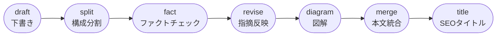
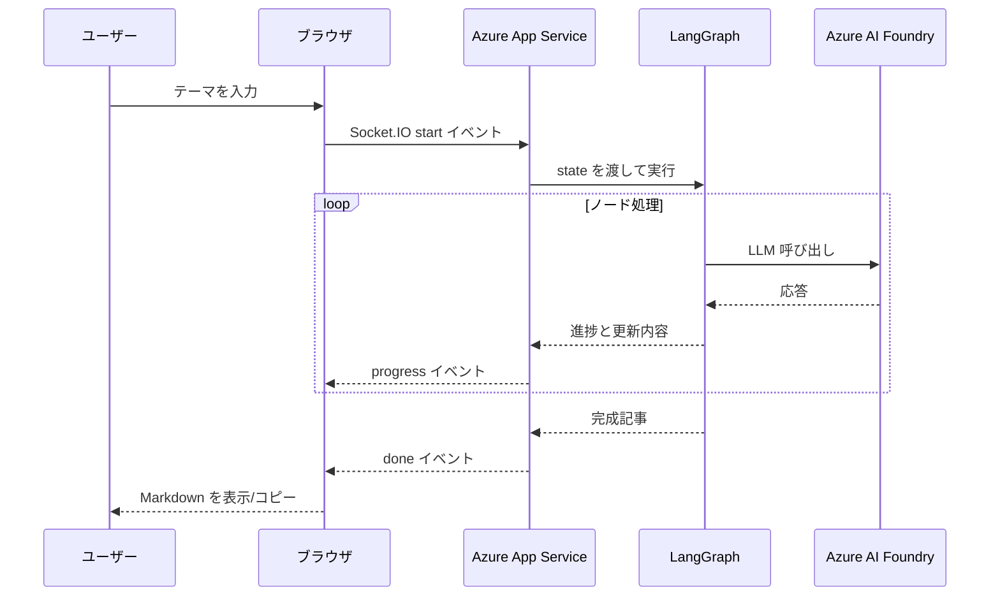

# Azure App Service×LangGraphで収益化記事を量産するやさしいチュートリアル

この記事は、「LangGraph や Azure をこれから触る初心者エンジニアだけど、note で有料記事を安定して公開できる仕組みを作りたい」という人に向けたものです。難しい専門用語はできるだけかみ砕き、「なぜその設定が必要なのか」「どこでつまずきやすいのか」を丁寧に説明します。

## この記事でできること
- テーマと伝えたいポイントを入力すると、LangGraph が「下書き→分割→ファクトチェック→リライト→図解→統合→タイトル」の流れで記事を自動生成
- Flask + Socket.IO で進捗をリアルタイム表示し、完成した Markdown をブラウザからコピー
- Azure AI Foundry 経由で Azure OpenAI (gpt-5.1 / gpt-5-mini) を安全に呼び出し
- 出来上がったアプリを Azure App Service にデプロイしてチームで共有
- Zenn / note に載せるときに役立つテンプレや運用のコツを把握

## ざっくり技術相関図
| 技術 | 役割 | 初心者向けメモ |
| --- | --- | --- |
| LangGraph | LLM の処理をノード単位で並べて制御する | 「フローチャートをコードで書く」イメージ。各ノードは関数。|
| Flask + Socket.IO | ブラウザからテーマを受け取り、進捗をリアルタイム表示 | Flask は API、Socket.IO はリアルタイム通信担当。|
| Azure AI Foundry | Azure OpenAI をまとめて管理するハブ | エンドポイントやキーを 1 か所で確認でき、App Service から安全に接続できる。|
| Azure App Service | 完成したアプリのホスティング先 | GitHub 連携やログ監視が簡単で、Python もそのまま動かせる。|

## 全体フローを先にイメージする
LangGraph 内部の流れと、ブラウザからクラウドまでの通信を最初に頭に入れておくと、途中で迷いません。

### LangGraph のノード構成


### ブラウザ〜Azure のやり取り


## 準備しておくもの
1. **Azure アカウント**: OpenAI リソースと App Service プランを作れるサブスクリプション。権限が不安なら管理者に「OpenAI と WebApp を作成できる RBAC が欲しい」と伝えておくとスムーズです。
2. **ローカル開発環境**: macOS / Linux / WSL2 で OK。Python 3.11、`uv`、`node`、`npm`、`az` CLI、`git` を入れておきます。
3. **Azure CLI 拡張**: `az extension add --name webapp`。Azure OpenAI を CLI で触る場合は `az extension add --name azure-ai-ml` も。
4. **ネットワーク設定**: 会社ネットワークの場合、`HTTPS_PROXY` が必要か確認。Socket.IO の WebSocket が遮断されていないかもチェック。

## プロジェクトを作る手順
```bash
cd ~/Desktop
mkdir -p create-article && cd create-article
uv init
uv venv && source .venv/bin/activate
uv add langchain langgraph langchain-openai openai tiktoken python-dotenv flask flask-socketio eventlet gunicorn
uv pip compile ./pyproject.toml > ./requirements.txt
touch .env
```

### pyproject.toml の最小構成
```toml:pyproject.toml
[project]
name = "create-article-p"
version = "0.1.0"
dependencies = [
  "flask",
  "flask-socketio",
  "langchain",
  "langgraph",
  "langchain-openai",
  "openai",
  "tiktoken",
  "python-dotenv",
]

[tool.uv]
python = "3.11"
```
`uv add ...` を実行すると上の依存関係が入り、`uv pip compile` でロックファイル (`requirements.txt`) ができます。

### どんなファイルが必要か
```text
create-article-p/
├─ app.py                # Flask + Socket.IO のエントリ
├─ graph.py              # LangGraph の定義
├─ templates/index.html  # 入力フォームと進捗UI
├─ static/app.js         # Socket.IO で進捗を表示
├─ prompts/*.txt         # LLM プロンプト
├─ article.md            # この記事の本文
├─ requirements.txt / pyproject.toml
└─ .env                  # 個人環境のシークレット
```
`scripts` フォルダなどは必要に応じて追加してください。`flask --app app run --debug` でローカル確認ができます。

### .env の例
```dotenv:.env.example
FLASK_ENV=development
API_VERSION=2024-05-01-preview
GPT_5_1_ENDPOINT=https://<your-openai>.openai.azure.com
GPT_5_1_DEPLOYMENT_NAME=gpt-5-1
GPT_5_1_SUBSCRIPTION_KEY=<secret>
GPT_5_MINI_ENDPOINT=https://<your-openai>.openai.azure.com
GPT_5_MINI_DEPLOYMENT_NAME=gpt-5-mini
GPT_5_MINI_SUBSCRIPTION_KEY=<secret>
LOG_LEVEL=INFO
CORS=*
```
`CORS` は本番で制限したい場合だけドメインを記入します。Azure App Service の App Settings にも同じキーを入れれば OK です。

## LangGraph のコードを読み解く
`graph.py` の中心部分を短く抜粋し、何をしているかをコメント付きで整理してみます。

```python:graph.py
from langchain_openai import AzureChatOpenAI
from langgraph.graph import StateGraph, END
...

class ArticleState(TypedDict):
    theme: str
    draft: str
    sections: dict[str, str]
    notes: dict[str, str]
    diagrams: dict[str, str]
    article: str
    seo_title: str


def generate_draft(state: ArticleState) -> dict:
    system_prompt = SystemMessage(content=_load_prompt("draft_system.txt"))
    human_prompt = HumanMessage(
        content=_load_prompt("draft_human.txt").format(theme=state["theme"])
    )
    draft = llm5_mini.invoke([system_prompt, human_prompt]).content
    return {"draft": draft}
```

ポイント:
- `ArticleState` は LangGraph 内で共有するデータ構造です。Python の `TypedDict` で定義すると、キーの見落としを防げます。
- `generate_draft` は `prompts/draft_*.txt` を読み込み、`gpt-5-mini` デプロイを使って最初の下書きを作ります。
- `_build_azure_llm` というヘルパーで、`GPT_5_1_*` など複数の接頭辞に対応しています。環境変数名を柔軟にしたいときに便利です。

以下は残りのノードの役割を初心者目線でまとめた表です。

| ノード | 何をするか | つまずきポイント |
| --- | --- | --- |
| `split` | 下書きを JSON 形式で「書き出し/本文/まとめ」に分ける | LLM が JSON 以外を返すことがあるので、`re.search` で `{...}` 部分だけ抜き出しています。 |
| `fact` | 各セクションを順番にファクトチェックし、メモを `notes` に保存 | チャット履歴が増えても暴走しないよう、ノードを分けて処理。 |
| `revise` | チェック結果を本文へ反映 | フィードバックがなければ元の文章をそのまま返すので、過修正が起きにくいです。 |
| `diagram` | Mermaid 図を生成（丸括弧は禁止など簡単な正規化も実施） | Mermaid は `()` に弱いので `[]` に置き換えておくと Zenn でエラーになりません。 |
| `merge` | 無料/有料パートを Markdown として結合 | 無料部分の最後で「ここから先は有料」を明示。テンプレ文言をここでまとめて管理できます。 |
| `title` | SEO タイトルを作り、本文先頭を差し替え | 一番最後に置くことで、無料/有料パートの文章が確定したあとにタイトルを調整できます。 |

## プロンプトをやさしく管理する
プロンプトを別ファイルにしておくと、Git で差分を追いつつ A/B テストしやすくなります。以下は代表例です。

### Mermaid 図のプロンプト
```txt:prompts/diagram.txt
以下の文章の内容を整理し、理解を助けるMermaid図を1つ作成してください。
...
```
主要なルール:
- `flowchart` 固定にしておくと、出力をそのまま Zenn に貼れます。
- コードフェンスは禁止、丸括弧はすべて角括弧/中括弧へ置換。

### ドラフトのユーザープロンプト
```txt:prompts/draft_human.txt
「{theme}」というテーマで、有料note向けの記事草稿を作成してください。
...
```
初心者が読むときに大事なのは「なぜ有料と無料を分けるのか」を言い換えておくことです。テンプレ文章のまま貼るのではなく、読者像・課題・欲しいアウトカムを必ず差し込むようにしましょう。

### ドラフトのシステムプロンプト
```txt:prompts/draft_system.txt
あなたはプロの編集者兼テクニカルライターです。
...
```
長く見えますが、やることはシンプルで「読者ペルソナを途中で変えない」「無料/有料の差分を必ず示す」ことの2点です。迷ったら冒頭のルールだけ再確認すると楽です。

## Flask + Socket.IO の UI ざっくり紹介
- `templates/index.html`: Bootstrap とフォームを使ったシンプルな画面。テーマ入力、進捗バー、ログ、完成記事の3カラム構成。
- `static/app.js`: jQuery で Socket.IO を初期化し、`progress`/`done`/`failed` イベントに応じて UI を更新。コピー機能は `navigator.clipboard.writeText` を使用。
- `app.py`: `SocketIO` を初期化し、`start` イベントで LangGraph を流し、逐次 `emit` で進捗を返します。CORS を環境変数から受け取るようにしておくと、後で本番ドメインだけ許可できます。

これらのファイルは初心者が読んでも迷わないよう、関数ごとに短いコメントを入れておくと安心です。

## Azure OpenAI (Azure AI Foundry) の設定
1. **リソースグループ作成**: `az group create -n article-ai-rg -l japaneast`
2. **Azure OpenAI リソース作成**: Portal で作成。リージョンは East US など対象の場所を選ぶ。
3. **デプロイ**: `gpt-5.1` と `gpt-5-mini` を 1 つずつ用意。モデル名とデプロイ名をメモ。
4. **Azure AI Foundry ハブ/プロジェクト**: ハブを作り、先ほどの OpenAI リソースを「Connection」として関連付けます。
5. **キーとエンドポイントを取得**: プロジェクトの Connections → Keys からコピーし、`.env` と App Service に入力。
6. **Playground で動作確認**: 何か質問して返答が来れば準備OK。ここでエラーが出る場合はアクセス権 (Cognitive Services OpenAI User) を疑うと解決しやすいです。

## Azure App Service にデプロイ
### インフラ作成
```bash
az login
az account set --subscription "<SUBSCRIPTION_NAME_OR_ID>"
az appservice plan create -g article-ai-rg -n article-plan --sku B1 --is-linux
az webapp create -g article-ai-rg -p article-plan -n article-ai-writer --runtime "PYTHON:3.11"
```

### スタートアップコマンド
```
gunicorn --worker-class eventlet --workers 1 --timeout 120 app:app
```
App Service の「構成 > スタック設定」に貼ります。`eventlet` を使うことで Socket.IO の長時間接続が安定します。

### App Settings (環境変数)
- `API_VERSION=2024-05-01-preview`
- `GPT_5_1_*`, `GPT_5_MINI_*` 系のキー
- `WEBSITES_PORT=8000`（Linux コンテナが待ち受けるポート）
- `WEBSITES_CONTAINER_START_TIME_LIMIT=600`（初回起動のタイムアウト緩和）

CLI でまとめて登録する場合:
```bash
az webapp config appsettings set \
  --name article-ai-writer \
  --resource-group article-ai-rg \
  --settings \
    API_VERSION=2024-05-01-preview \
    GPT_5_1_ENDPOINT=https://xxx.openai.azure.com \
    GPT_5_1_DEPLOYMENT_NAME=gpt-5-1 \
    GPT_5_1_SUBSCRIPTION_KEY=<your-key> \
    GPT_5_MINI_ENDPOINT=https://xxx.openai.azure.com \
    GPT_5_MINI_DEPLOYMENT_NAME=gpt-5-mini \
    GPT_5_MINI_SUBSCRIPTION_KEY=<your-key> \
    WEBSITES_PORT=8000 \
    WEBSITES_CONTAINER_START_TIME_LIMIT=600
```

### デプロイ方法
- **ローカルから**: `az webapp up --name article-ai-writer --resource-group article-ai-rg --runtime "PYTHON:3.11"`
- **GitHub Actions**: `azure/webapps-deploy@v2` を使うワークフローを用意し、`AZURE_WEBAPP_PUBLISH_PROFILE` を Secrets に登録。
- **Deployment Center**: Portal からリポジトリとブランチを選ぶだけで自動デプロイ設定ができます。

### ログを確認する
```bash
az webapp log config -n article-ai-writer -g article-ai-rg --application-logging filesystem --level information
az webapp restart -n article-ai-writer -g article-ai-rg
az webapp log tail -n article-ai-writer -g article-ai-rg
```
`log tail` に `Engine.IO connection established` が出れば Socket.IO がつながっています。エラーが出る場合は、`requirements.txt` を最新化して再デプロイするのが定番の解決策です。

## 運用とトラブルシューティング
| 症状 | よくある原因 | 直し方 |
| --- | --- | --- |
| `401 Unauthorized` | キーの貼り間違い / 権限不足 | App Settings を再確認し、Portal でキーを再発行。 |
| `429 Too Many Requests` | Azure OpenAI のレート制限 | gpt-5.1 の同時実行を減らし、一部ノードを gpt-5-mini に切り替える。 |
| Socket.IO が固まる | スタートアップコマンド未設定 / CORS ミス | eventlet + `cors_allowed_origins` を見直す。 |
| Mermaid が崩れる | `()` が含まれている | `diagram` ノードで角括弧へ置換する処理を追加する。 |

**デプロイ後チェックリスト**
- [ ] ブラウザからテーマを 2 回以上流し、毎回 100% まで進む
- [ ] App Service の App Settings が `.env` と同じ内容
- [ ] Log Stream で `DONE article` のような完了ログが出ている
- [ ] 必要なら Application Insights や Workbook で監視を設定

## note / Zenn への載せ方
1. `article.md` をプレビューし、無料/有料境界が崩れていないかを確認。
2. 有料特典 (テンプレ、スプレッドシート、動画など) をクラウドにアップロードし、限定アクセス設定を済ませる。
3. タイトル・タグ・価格を設定し、サムネイルを今回のプロンプトで生成。
4. 公開後はコメント欄で「どこで詰まったか」をヒアリングし、テンプレ改善につなげる。

## ChatGPT 単体での執筆との違いを理解する
| 観点 | ChatGPT だけ | 今回の LangGraph 構成 |
| --- | --- | --- |
| プロンプト管理 | 会話履歴をスクロールして再利用 | `prompts/*.txt` で Git 管理できる |
| 品質の安定度 | セッションごとに出力が変わりやすい | ノードごとに責務を固定し、暴走しにくい |
| 無料/有料の切り替え | 自分で毎回境界を書く | `merge` ノードでテンプレ化 |
| チーム共有 | ブラウザの履歴を共有するしかない | Azure App Service の URL を共有するだけ |
| コスト | OpenAI サブスクのみ | Azure OpenAI + App Service だが、再利用性が高い |

## まとめ
- LangGraph を使うと「どの工程が終わったか」を把握しやすく、初心者でもフローを追いながら改善できます。
- Flask + Socket.IO は構成がシンプルなので、まずローカルで仕組みを理解してから Azure へ持っていくと失敗が減ります。
- Azure App Service に乗せると、URL を共有するだけでチーム全員が同じ品質で有料記事を作れるようになります。
- つまずいたら「権限」「環境変数」「スタートアップコマンド」の3点を優先的に確認しましょう。

じっくりステップを踏めば、初めてのクラウドデプロイでも十分にやり切れます。気負わず、少しずつハンズオンしていきましょう。
